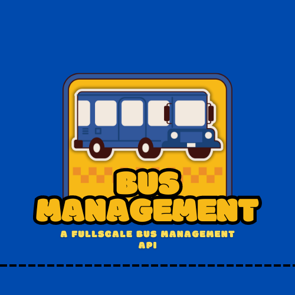

<p align="center">

</p>
<p align="center">


</p>


# API de Gestao e organizaçao para Ônibus 🚌🚍

um sistema profissional para gestao e organizaçao de veiculos de transporte. A API é capaz de registrar, excluir e alterar o registro de onibus funcionando na empresa, como tambem manipular seus passageiros e organizar automaticamente a posiçao de cada um deles.
 


## Rodando o Projeto 🏃‍♂️💻
```
git clone https://github.com/ciringa/BusManagement-API.git
```
```
cd BusManagementAPI
```
```
npm i
```
```
npm run start
```
## Features 🚀

- Criação e estruturação de passageiros.
- Organizaçao de assentos baseado no destino de cada passageiro.
- Criação, Edição e exclusão dos onibus cadastrados.
## Documentação

Quando a Aplicaçao estiver rodando acesse: [Documentação](http://[::1]:2333)


## Tech Stack


## Criterio de Organização de Passageiros 

imagine um algoritmo de organização para ônibus de uma determinada empresa. o algoritmo tem como objetivo organizar os passageiros em suas cadeiras baseado no destino em que cada um deles deseja chegar( A, B ou C sendo A o mais próximo e C o mais distante), o sistema deve interpretar que, um passageiro que deseja chagar ao ponto A, evidentemente chegará primeiro do que o passageiro que deseja chegar ao ponto C, portanto é mais pratico que passageiro que deseja chegar em A se sente mais próximo da porta, enquanto o passageiro que deseja chegar a C se sente nas cadeiras mais ao fundo(porem ainda o mais próximo da porta possível). Tratando de linguagem de código podemos definir a seguinte regra: o passageiro A deve se sentar mais a frente que os passageiros B e C
